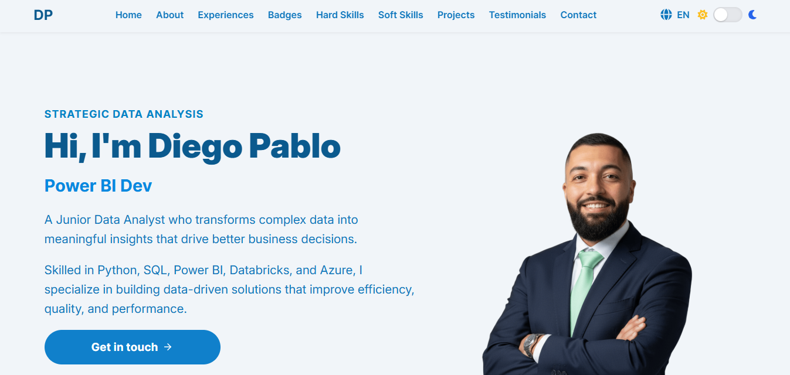
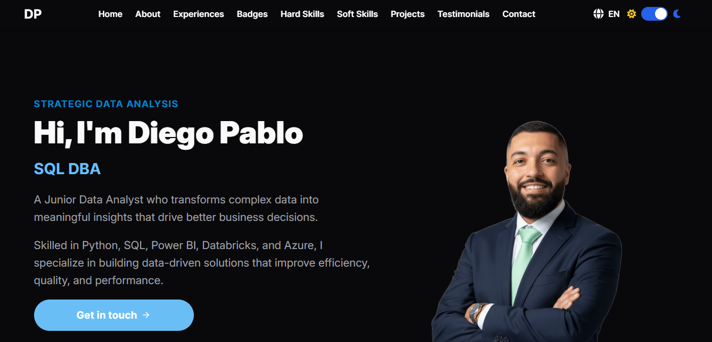

# Meu Portfólio Pessoal

Um portfólio moderno, responsivo e interativo construído com as mais recentes tecnologias do Angular para exibir minhas competências, projetos e trajetória profissional na área de Dados.

### [Acesse a versão ao vivo aqui!](https://diego-pablo.vercel.app)

## Visualização (Modo Escuro)

Prévia do design do portfólio no tema escuro, destacando a legibilidade e a estética moderna.




---

## 🎯 Sobre o Projeto

Este projeto foi desenvolvido para ser meu cartão de visitas digital. O objetivo é apresentar de forma clara e objetiva minha jornada como Analista de Dados, minhas habilidades técnicas (Hard Skills) e interpessoais (Soft Skills), além dos projetos em que trabalhei.

O design foi pensado para ser limpo e focado no conteúdo, com total responsividade para uma ótima experiência em desktops, tablets e celulares.

---

## ✨ Principais Funcionalidades

-   **Design Responsivo**: Adaptável a qualquer tamanho de tela.
-   **Tema Claro e Escuro**: Alternância de tema para preferência visual do usuário.
-   **Internacionalização (i18n)**: Suporte para Português (PT) e Inglês (EN).
-   **Arquitetura Moderna com Angular**: Construído com componentes Standalone e reatividade baseada em Signals.
-   **Seções Dinâmicas**:
    -   **Hero**: Apresentação inicial com efeito de digitação.
    -   **Sobre Mim**: Detalhes sobre minha trajetória e paixões.
    -   **Experiências**: Linha do tempo interativa da minha carreira profissional.
    -   **Competências**: Exibição de Hard e Soft Skills com barras de progresso.
    -   **Conquistas**: Grade com badges e certificações oficiais.
    -   **Projetos**: Cards detalhando meus principais trabalhos.
    -   **Depoimentos**: Recomendações de colegas e gestores.
    -   **Contato**: Links diretos para minhas redes e formas de contato.
-   **Estilização com SCSS**: Uso de variáveis para facilitar a manutenção e garantir consistência visual.

---

## 🚀 Tecnologias Utilizadas

-   **Frontend**:
    -   [Angular](https://angular.io/) (v20+)
    -   [TypeScript](https://www.typescriptlang.org/)
    -   [SCSS](https://sass-lang.com/)

-   **Bibliotecas**:
    -   [Font Awesome](https://fontawesome.com/) para ícones.

-   **Ferramentas de Desenvolvimento**:
    -   [Angular CLI](https://cli.angular.io/)
    -   [Git & GitHub](https://github.com/)

---

## 🔧 Como Começar

Siga os passos abaixo para executar o projeto em seu ambiente local.

### Pré-requisitos

Você precisa ter o Node.js e o Angular CLI instalados em sua máquina.

-   [Node.js](https://nodejs.org/) (versão 18 ou superior)
-   Instale o Angular CLI globalmente:
    ```bash
    npm install -g @angular/cli
    ```

### Instalação e Execução

1.  **Clone o repositório:**
    ```bash
    git clone https://github.com/DiegoPablo2021/Diego-Portfolio-2025.git
    ```

2.  **Navegue até o diretório do projeto:**
    ```bash
    cd Diego-Portfolio-2025
    ```

3.  **Instale as dependências:**
    ```bash
    npm install
    ```

4.  **Execute o servidor de desenvolvimento:**
    ```bash
    ng serve -o
    ```
    O comando `-o` abrirá automaticamente o projeto em seu navegador no endereço `http://localhost:4200/`.

### Build para Produção

Para gerar os arquivos de produção, execute o comando:
```bash
ng build
